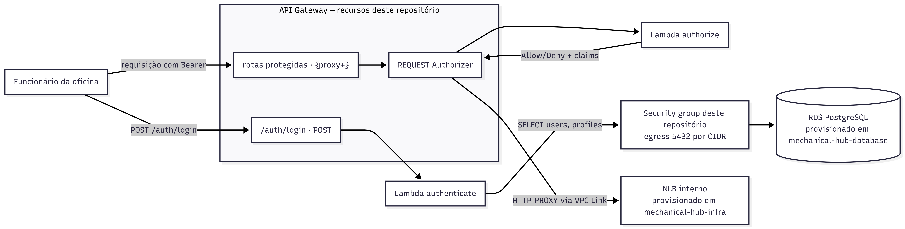
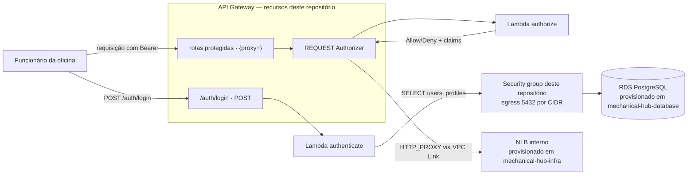

# Mechanical Hub — Autenticação Serverless

Funções serverless de **autenticação** e **autorização** do Mechanical Hub (Tech Challenge — Fase 3).

Repositório independente do da aplicação principal (`mechanical-hub`), com ciclo de deploy próprio.

- **Spec de referência:** `docs/specs/lambda-authorizer-spec.md` (repositório `mechanical-hub`)
- **Decisão arquitetural:** ADR-0001 — Autenticação de funcionários via CPF

---

## O que este repositório faz

| Função | Papel |
|---|---|
| **`authenticate`** | Recebe CPF + senha, consulta o banco, verifica a senha e emite um JWT. Exposta em `POST /auth/login`. |
| **`authorize`** | Authorizer do API Gateway. Valida o token e o perfil contra a rota pedida, devolvendo Allow/Deny. |

Quem autentica são **funcionários da oficina** (mecânicos e administradores). O cliente final nunca faz login — as rotas dele (`/mechanical-hub/service-orders/**`) seguem públicas.

---

## 🛠️ Tecnologias

| Camada | Tecnologia |
|---|---|
| Linguagem | TypeScript 5.5 |
| Runtime | Node.js 20.x (`nodejs20.x` na AWS Lambda) |
| Autenticação/hash | `jsonwebtoken` (JWT HS256) + `bcryptjs` |
| Banco de dados | `pg` (cliente PostgreSQL puro, sem ORM) |
| Segredos | Variável de ambiente (lab) ou `@aws-sdk/client-secrets-manager` (produção) |
| Bundler | esbuild |
| Testes | Vitest + `@vitest/coverage-v8` (mínimo 80% de cobertura) |
| IaC | Terraform >= 1.5, provider AWS ~> 5.0 |
| Nuvem | AWS Lambda + API Gateway (REST) |
| CI/CD | GitHub Actions |

---

## 🏗️ Arquitetura deste repositório

Recursos provisionados aqui (Terraform em `infra/terraform/`) e como eles se conectam ao que os outros repositórios provisionam:





O desenho completo da plataforma (as quatro repositórios, nuvem, banco e observabilidade) está em `docs/ARCHITECTURE.md` no repositório `mechanical-hub`.

---

## Arquitetura do código

O código é dividido em três camadas, e a dependência aponta sempre para dentro:

```
src/
├── core/            ← regra de negócio. Não importa nada de AWS, HTTP ou banco.
│   ├── domain/         validação de CPF, erros, perfis, matriz de acesso
│   ├── ports/          interfaces (UserRepository, TokenService, SecretProvider, ...)
│   └── usecases/       authenticate-user, authorize-access
│
├── adapters/        ← implementações das portas
│   ├── persistence/    PostgreSQL via pg
│   ├── secrets/        variável de ambiente | AWS Secrets Manager | cache
│   ├── security/       JWT (HS256) e BCrypt
│   ├── ratelimit/      contador de tentativas
│   └── observability/  log JSON estruturado
│
├── entrypoints/
│   ├── http/           contrato HTTP neutro + controllers
│   └── aws-lambda/     ÚNICO lugar que conhece o formato de evento da AWS
│
└── composition/     ← raiz de composição (config + container)
```

**Migrar para outro provedor** (Azure Functions, Cloud Functions, Knative) significa escrever um novo diretório em `entrypoints/` e um novo `SecretProvider`. `core/`, `adapters/security`, `adapters/persistence` e os testes não mudam.

Nada em `core/` importa `aws-lambda`, `@aws-sdk` ou `process.env` — essa é a linha que não deve ser cruzada em nenhuma alteração futura.

---

## Restrições do AWS Academy Lab

O laboratório impõe limitações que moldaram decisões concretas:

| Limitação | Decisão |
|---|---|
| Não é possível criar IAM roles | O Terraform recebe o ARN da `LabRole` já existente via variável |
| Secrets Manager indisponível | `SECRET_PROVIDER=environment` — segredos em variável de ambiente da função. O adaptador de Secrets Manager já está implementado para produção; é trocar uma variável |
| RDS Proxy indisponível (exige role própria) | Conexão direta ao RDS, com pool limitado a **2 conexões por instância** |
| Sem concorrência provisionada | Cold start mitigado por bundle enxuto (esbuild), inicialização fora do handler e 512 MB de memória |
| Credenciais temporárias que expiram | `AWS_ACCESS_KEY_ID`, `AWS_SECRET_ACCESS_KEY` e `AWS_SESSION_TOKEN` precisam ser atualizados a cada sessão do lab antes de rodar o deploy |

---

## Executando localmente

```bash
npm ci
cp .env.example .env      # preencha DATABASE_* e TOKEN_SIGNING_KEY

npm run typecheck
npm test
npm run test:coverage     # falha se a cobertura cair abaixo de 80%
npm run build             # bundles em dist/
npm run package           # zips em build/
```

---

## Contrato da API

### `POST /auth/login`

```json
{ "cpf": "529.982.247-25", "password": "senha-do-funcionario" }
```

**200**
```json
{ "accessToken": "eyJhbGciOiJIUzI1NiIs...", "tokenType": "Bearer", "expiresIn": 7200 }
```

**Erros** — corpo sempre no formato `{ error, message, traceId }`:

| Situação | HTTP | `error` |
|---|---|---|
| Corpo ausente ou campo faltando | 400 | `INVALID_REQUEST` |
| CPF com dígito verificador inválido | 400 | `INVALID_CPF` |
| CPF inexistente **ou** senha incorreta | 401 | `INVALID_CREDENTIALS` |
| Funcionário desativado | 403 | `USER_INACTIVE` |
| Tentativas excedidas | 429 | `TOO_MANY_ATTEMPTS` |
| Falha interna | 500 | `INTERNAL_ERROR` |

> CPF inexistente e senha errada devolvem a mesma resposta, e ambos passam pelo mesmo custo de tempo (comparação BCrypt descartável). Sem isso seria possível descobrir quais CPFs estão cadastrados medindo latência.

**Swagger/Postman:** este repositório não expõe uma API CRUD — apenas os dois contratos acima (`POST /auth/login` e o Authorizer). Não há Swagger próprio; o Swagger da plataforma é o da aplicação principal (`mechanical-hub`, ver o README daquele repositório). Os exemplos de request/response desta seção podem ser colados diretamente em Postman/Insomnia.

### Claims do token

```json
{
  "iss": "mechanical-hub-auth",
  "sub": "<uuid do funcionário>",
  "aud": "mechanical-hub-api",
  "cpf": "52998224725",
  "name": "Maria Silva",
  "role": "ADMINISTRATOR",
  "iat": 1753600000,
  "exp": 1753607200,
  "jti": "<uuid>"
}
```

`role` ∈ `{ MECHANICAL, ADMINISTRATOR }` — o valor canônico de `profiles.name`.

---

## Matriz de acesso

Vive em `src/core/domain/access-policy.ts` e é coberta por teste unitário. **Espelha a `SecurityConfiguration` da aplicação principal — as duas mudam juntas.**

| Rota | Acesso |
|---|---|
| `/auth/login` | Público |
| `/actuator/health/**`, `/swagger-ui/**`, `/v3/api-docs/**` | Público |
| `/mechanical-hub/service-orders/**` | Público (cliente final) |
| `/users/**`, `/customers/**`, `/vehicles/**`, `/services/**`, `/materials/**`, `/stock/**`, `/reports/**` | `ADMINISTRATOR` |
| `/service-orders/**` | `MECHANICAL` ou `ADMINISTRATOR` |
| qualquer outra | **Negada** (default deny) |

---

## Contrato de banco

A função lê `users` e `profiles`, e **nunca escreve**. O dono do schema é o repositório `mechanical-hub` (migrations Flyway).

Colunas do contrato: `users.document_number`, `users.password_hash`, `users.deleted_at`, `users.profile_id`, `profiles.name`.

Antes do primeiro deploy:

1. Aplicar as migrations `V18`, `V19` e `V20` no repositório da aplicação principal.
2. Criar o usuário de banco somente-leitura. A role **não pertence mais a este repositório**: por decisão da ADR-0002, ela é definida em `sql/auth-database-role.sql`, no `mechanical-hub-database`. Rode o workflow `Deploy` daquele repositório marcando `criar_role_de_autenticacao`, ou execute o script à mão com o usuário master.

A senha usada ali (secret `AUTH_DB_PASSWORD` do `mechanical-hub-database`) precisa ser a mesma informada aqui em `TF_VAR_database_password`.

`deleted_at` é a única fonte de verdade sobre atividade do funcionário: `NULL` = ativo. Não existe coluna `status`.

---

## Deploy

```bash
npm run package

cd infra/terraform
cp terraform.tfvars.example terraform.tfvars   # preencha os buckets de state
export TF_VAR_database_password='...'
export TF_VAR_token_signing_key='...'

# bucket e região do backend não são versionados — vêm no init
terraform init \
  -backend-config="bucket=<bucket-de-state>" \
  -backend-config="region=us-east-1"

terraform plan
terraform apply
```

O workflow `.github/workflows/deploy.yml` faz o mesmo automaticamente no push para `main`, e termina com um smoke test do login.

### Secrets do repositório

| Secret | Uso |
|---|---|
| `AWS_ACCESS_KEY_ID`, `AWS_SECRET_ACCESS_KEY`, `AWS_SESSION_TOKEN` | Credenciais temporárias do lab |
| `LAB_ROLE_ARN` | ARN da LabRole |
| `TF_STATE_BUCKET` | Bucket S3 do state — usado no backend e na leitura dos states de `infra` e `database` |
| `DATABASE_PASSWORD` | Senha da role de banco (a mesma do `AUTH_DB_PASSWORD` no `mechanical-hub-database`) |
| `TOKEN_SIGNING_KEY` | Chave HS256 (mínimo 32 caracteres) |
| `SMOKE_TEST_CPF`, `SMOKE_TEST_PASSWORD` | Opcionais, para o smoke test pós-deploy |

> **`VPC_SUBNET_IDS`, `VPC_SECURITY_GROUP_IDS`, `DATABASE_HOST` e `APPLICATION_BASE_URL` não são mais necessários.** Podem ser removidos do repositório. O endereço da aplicação agora é resolvido do state do `mechanical-hub-infra` (`app_backend_base_url`) — ver seção abaixo.

---

## Dependência entre repositórios

Este repositório **lê os states remotos** dos dois que vêm antes dele na ordem de provisionamento, conforme a ADR-0002 — nada de rede ou de endereço de banco é informado à mão:

| Origem | Outputs consumidos | Vira |
|---|---|---|
| `mechanical-hub-infra` | `vpc_id`, `private_subnet_ids` | VPC do security group e subnets das funções |
| `mechanical-hub-infra` | `app_nlb_arn`, `app_backend_base_url` | Alvo do VPC Link (`aws_api_gateway_vpc_link`) e `uri` das integrações `HTTP_PROXY` |
| `mechanical-hub-database` | `rds_endpoint`, `rds_port`, `rds_db_name` | `DATABASE_HOST`, `DATABASE_PORT`, `DATABASE_NAME` |

Ordem de **dependência de state**: `infra` → `database` → **`auth`** → `mechanical-hub`.

**Sobre `app_nlb_arn`/`app_backend_base_url`:** ao contrário dos demais outputs de `infra`, este não depende do `mechanical-hub` já ter feito deploy — o NLB é provisionado pelo `mechanical-hub-infra` (não pelo Kubernetes) e existe assim que `infra` aplica, ainda que sem alvos saudáveis no target group até a aplicação subir. Por isso o `terraform apply` deste repositório nunca fica bloqueado esperando o `mechanical-hub`.

**Isso não muda a ordem para o smoke test.** O `deploy.yml` roda um login de verdade logo após o `apply`, e só recebe 401 (em vez de 500) se a role `mechanical_hub_auth` já existir com acesso a `users.document_number` — o que exige as migrations Flyway V18–V20 do `mechanical-hub` (criam a coluna) e o job da role no `mechanical-hub-database` já executados antes. O smoke test fala direto com a Lambda, sem passar pelo NLB/Service, então essa dependência é sobre dados no banco, não sobre rede. Na prática, a sequência que faz este workflow passar da primeira vez continua sendo `infra → database → mechanical-hub (deploy) → job da role → auth`.

**O que isso resolve no ciclo do Lab.** A cada reset do ambiente, subnets e endpoint do RDS mudam. Antes, era preciso reeditar três secrets no GitHub antes de qualquer deploy funcionar. Agora a pipeline lê os valores atuais sozinha.

**O que continua vindo de secret.** `database_password` e `token_signing_key`. Output de Terraform fica gravado em claro no arquivo de state — valor sensível não trafega por ali.

**Security group.** Criado *neste* repositório (`network.tf`), com egress apenas na porta do banco, restrito ao CIDR da VPC. A ADR-0002 rejeitou explicitamente criá-lo no `mechanical-hub-infra`: seria um recurso órfão, pertencente conceitualmente a `auth`. O banco libera acesso por CIDR das subnets privadas, então não precisa conhecer este SG — é o que evita a dependência circular, já que `database` é aplicado antes de `auth`.

### Overrides locais

Todas as variáveis de rede e de banco continuam existindo com default vazio. Preenchidas, têm precedência sobre o state — útil para apontar para um ambiente avulso ou destravar um deploy com state indisponível:

```bash
export TF_VAR_vpc_subnet_ids='["subnet-aaa","subnet-bbb"]'
export TF_VAR_database_host='meu-rds.us-east-1.rds.amazonaws.com'
```

Os outputs `resolved_vpc_id`, `resolved_subnet_ids` e `resolved_database_host` mostram o que foi efetivamente usado — vale conferir depois de um reset do Lab.

---

## Observabilidade

Uma linha JSON por evento em stdout, coletada pelo CloudWatch:

```json
{"timestamp":"2026-07-29T16:30:00.000Z","level":"warn","service":"mechanical-hub-auth",
 "event":"login.failed","reason":"INVALID_CREDENTIALS","cpfMasked":"***.***.247-25","traceId":"..."}
```

Eventos: `login.attempt`, `login.success`, `login.failed`, `login.blocked`, `login.error`, `authorizer.allow`, `authorizer.deny`, `authorizer.error`.

Senha nunca é registrada. CPF só aparece mascarado (`***.***.247-25`).

---

## Pontos de atenção conhecidos

- **Cache do authorizer (300s):** desativar um funcionário leva até 5 minutos + o tempo restante do token para surtir efeito. Aceito nesta fase; uma lista de revogação por `jti` resolveria.
- **Limitador de tentativas em memória:** o contador é por instância de execução, não global. A contenção real de volume é o throttling do API Gateway. Trocar por armazenamento distribuído é implementar a porta `AttemptLimiter`.
- **A aplicação principal confia nos cabeçalhos do Gateway.** Ela precisa ser inalcançável fora do Gateway (ALB interno + Security Group restrito), senão qualquer um que chegue ao pod forja `x-user-role` e vira administrador.
- **Chave HS256 compartilhada:** rotacionar exige janela de aceitação dupla, senão os tokens em circulação quebram.
